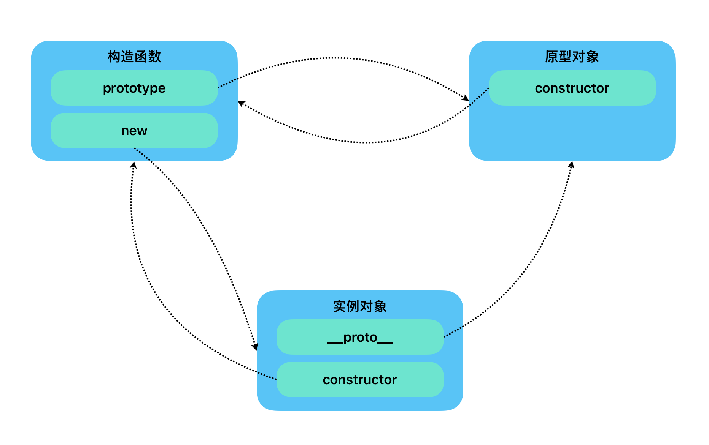
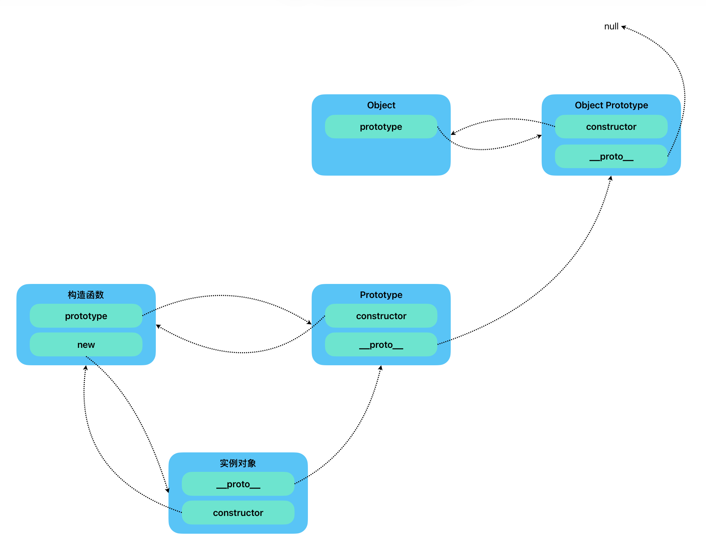

# 	JavaScript

## 函数

### 参数

#### 动态参数

``` javascript
function fu() {
    arguments
}
```

已经不再建议在TS中使用动态参数了，在TS中无法声明动态参数的类型，且动态参数是一个伪数组无法使用数组内的方法

#### 剩余参数

在TS中更加推荐使用剩余参数获取

``` typescript
function fu(...args: (number | string)[]) {
    args.forEach((value) => {
        console.log(value)
    })
}
```

### this指向问题

#### 在原始的函数写法中

**普通函数的this在调用时定义**：普通函数的this指向调用者

##### 此时的this指向调用者

``` javascript
function whoThis () {
  console.log(this)
}

whoThis() // window
```

##### 我们来嵌套的更加深入一点

``` javascript
const obj = {
  oname: "value",
  sayHi: function () {
    console.log(this)
  }
}

obj.sayHi() // obj
```

此时的this指向依然是调用者

#### 在箭头函数写法中

**箭头函数的this在定义时确定**：箭头函数继承外层的this

##### 此时的this指向最近作用域的this

``` javascript
const whoThis = () => {
    console.log(this)
}
```

##### 依旧是更加深入一点

```javascript
const obj = { // 对象字面量并不生成词法作用域
    oname: "张昱",
    sayHi: () => {
        console.log(this) // window
    }
}
```

##### 再更加深入一点点

```javascript
const obj = {
    oname: "张昱",
    fn: function () { // 生成了词法作用域 所以箭头函数的this继承了fn的this，fn的调用者是obj，所以fn的this指向的是obj
        let i = 0
        const fun = () => {
            console.log(this) // obj
        }
        fun()
    }
}
```

### 构造函数

#### JavaScript中构造函数的基本格式

``` javascript
function Constructor (name,age) {
  this.name = name
  this.age = age
}

Constructor.prototype.fn = function () {
  console.log("Value")
}
```

#### 构造函数中的this指向

同**普通函数**一样构造函数中的this指向的都是调用者，同样的**原型对象**中的this也是指向调用者

#### 构造函数中的原型对象(prototype)

##### 所有定义在prototype下的方法都是实例方法(instance methods)

```typescript
const arr = [1,2,3,4]

// js中定义好的实例方法
arr.push()

function Star() {
  
}

// 这里使用js写的，在ts中会类型检查报错,ts中的定义方式见TypeScript文档中的Prototype
// 这里定义的也是实例方法
Star.prototype.sing = function() {
  console.log('sing')
}
```

#### 构造函数原型对象中的constructor

##### JavaScript

```javascript
function Star(name) {
  this.name = name
}
```

##### TypeScript

```typescript
function Star(this: {name: string},name: string) {
  this.name = name
}

console.log(Star.prototype.constructor === Star)
// true
```

##### 在使用对象给prototype批量添加方法时候，会导致constructor丢失，我们只需重新将constructor重新指向构造函数即可

``` typescript
function Star(this: { name: string }, name: string) {
    this.name = name
}

Star.prototype = {
    // 将constructor重新指回构造函数
    constructor: Star,
    sing: function () {
        console.log("sing")
    },
    dance: function () {
        console.log('song')
    }
}
```

#### 在实例对象中的对象原型(Object Prototype)

##### 在所有创建的实例对象中，都有一个属性**\_\_proto\_\_**指向该构造函数的原型对象(prototype)

```typescript
const arr = [1,2,3]
const str = 'String'

// 此属性--已废弃--但在有些浏览器中仍能获取到该属性，在ES规范中已不在推荐使用此属性获取prototype
arr.__proto__
str.__proto__
// https://developer.mozilla.org/zh-CN/docs/Web/JavaScript/Reference/Global_Objects/Object/proto

// 获取prototype的方法
Object.getPrototypeOf(obj)

// 验证获取到的是否是原型对象
console.log(Object.getPrototypeOf(arr) === Array.prototype) // true

```

##### 同样的在对象原型里依然有constructor属性指向原型对象的构造函数

```typescript
console.log(Object.getPrototypeOf(arr).constructor === Array) // true

```

##### 原型链

在构造函数中，**prototype**属性指向该函数的原型对象(prototype),在原型对象中会有\_\_proto\_\_属性指向原型对象(prototype)的对象原型。

在原型对象中，constructor的属性会指向构造函数(Constructor),其原型链和上方所述一致。

Object的对象原型为null





##### instanceof用于检测构造函数的prototype属性是否出现在某个实例对象(instance object)的原型链(prototype chain)上

例：

```javascript
function Star() {
  
}

const Cxk = new Star()

console.log(cxl instanceof Star) // true
console.log(cxl instanceof Object) // true
```

### 拷贝

#### 浅拷贝


​	

### Closure(闭包)

#### 闭包

##### 原始定义

在一个**函数环境**中，闭包 = **函数** + **词法环境**

``` javascript
function fn(){
  // 函数外部的词法环境
  let x = 1;
  // 函数
  function fun(){
    
  }
}
```

##### JavaScript中优化后的定义

在经过现代浏览器优化后，在原始定义的闭包内，没有使用到词法环境中定义的变量，避免内存问题，就不建立闭包。

``` javascript
function fn() {
	let x = 1
  function fun() {
    return x
  }
  fun()
}
```

闭包是在函数内部创建一个内部函数，**内部函数**能访问它的*外部作用域*

**外部**也可以访问*函数内部的变量*

在JavaScript中闭包会随着函数的创建而创建

##### 闭包的基本格式

``` javascript
function init() {
  var name = "Mozilla"
  funcation displayName() {
    console.log(name)
  }
  return displayNmae
}

const myFunc = init()
myFunc()
```

#### 闭包会导致内存泄漏？

在非极端情况下，闭包并不会导致内存泄漏

通常我们所说的闭包会导致内存泄漏，是因为在对象没有被引用时候，并没有被GC回收这部分内存。

但闭包的生命周期与函数的生命周期是相同的在所属的生命周期结束时，这部分对象也同时会被GC回收

只不过在生命周期内，在对象未被引用时GC不会主动回收该内存空间，但这并非传统意义上的内存泄漏，这更像是开发者编码规范问题导致的内存滥用，在引用结束之后将**引用对象置空**就可以解决这个问题。

**例：**

``` javascript
funcation createFn() {
  const obj = {
    a: 1
  }
  
  return funcation (){
    return obj
  }
}

let fn = createFn()

let b = fn()

funcation onClick() {
  b = null
  fn = null
}
```

### 防抖与节流

#### 防抖(debounce)

在指定时间内触发多次只执行最后一个

```typescript
const debounce = (fn: function,t: number) => {
  const timer : number | null
  return () => {
    if(timer) {
     	clearTimeout(timer)
    }
    timer = setTimeout(() => {
      fn()
    }, t)
  }
}
```

#### 节流(throttle)

在指定时间内，只触发一次，在当前触发结束之后才可继续触发

```typescript
const throttle = (fn: function,t: number) => {
  const timer: number | null
  return () => {
    if(!timer){
      setTimeout(() => {
        fn()
      }, t)
      timer = null
    } 
  }
}
```

