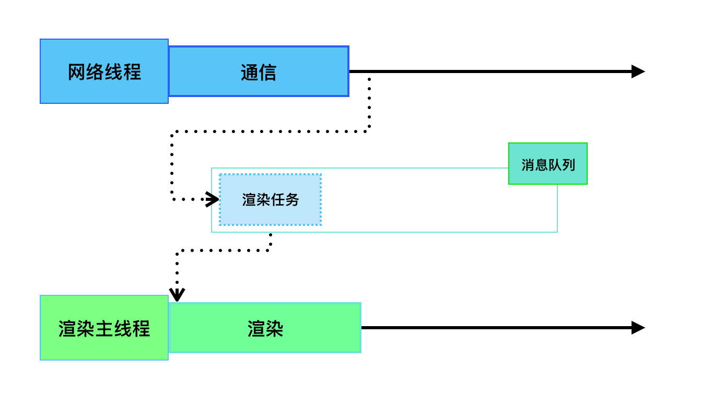
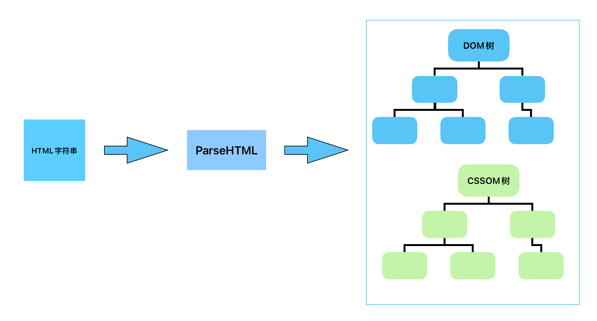
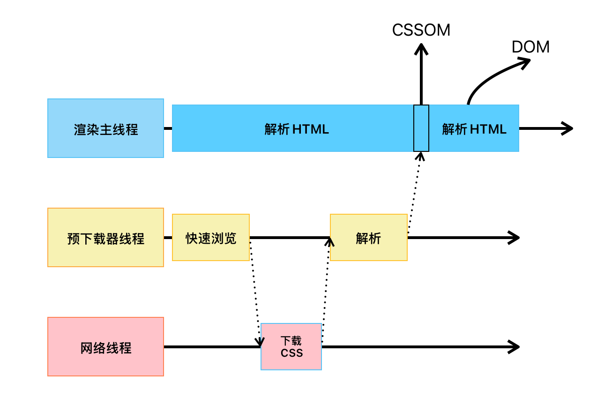
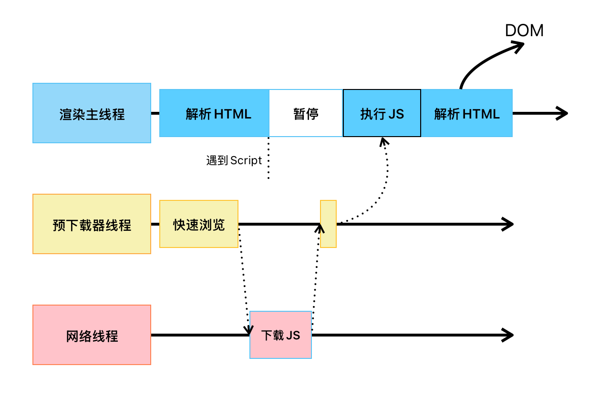
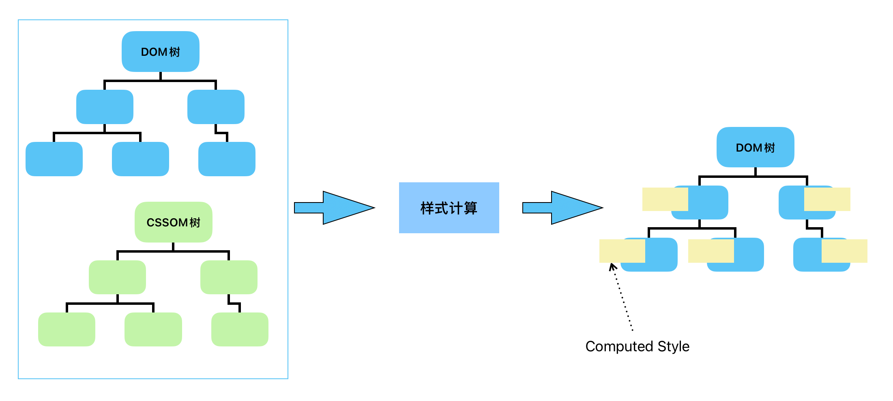

# Event Loop

## 写这个之前先明确一些概念

### 单线程

JavaScript为**单线程**语言，即使有了诸如Web Worker这类型的API，JavaScript也依然是一门单线程语言，所有的页面渲染、HTML、CSS、JavaScript代码的解析与执行、样式计算、布局计算等等，都只由JavaScript的**渲染主线程**执行。

### EventLoop / MessageLoop

一个代理（Agent）拥有一个事件循环（Eventloop）

每个代理（Agent）运行在一个线程上

**事件循环(EventLoop)**：在开始时，渲染主线程会进入一个无限循环，每次循环都会检查消息队列中是否有任务存在。如果有就取出最早/第一个任务执行，执行完后进入下一个循环，如果没有则进入休眠状态。

其他所有线程（包括其他进程的线程）可以随时向消息队列中添加任务，新的任务将添加到消息队列的末尾。在添加新任务时，如果渲染主线程是休眠状态，则会将其唤醒以继续循环拿取任务。

> [!IMPORTANT]
>
> 整个过程，被称之为事件循环(EventLoop)/消息循环(MessageLoop)

### Task queue

单个Task之间没有优先级区分，但是每个相同类型的Take只能放在同一个Task queue中，

Task queue之间有优先级区分

| 任务队列        | 优先级                       | 典型来源                                     |
| --------------- | ---------------------------- | -------------------------------------------- |
| 微任务队列      | 最高                         | Promise.then/catch/finally、queueMicrotask() |
| 用户交互队列    | 高                           | 鼠标点击、键盘输入等                         |
| 延迟任务队列    | 中                           | setTimeout、setInterval等                    |
| 网络/IO任务队列 | 中                           |                                              |
| 渲染任务队列    | 一般在微队列清空后视情况调用 | 样式计算、布局、画面重绘                     |

> [!WARNING]
>
> 具体的Task queue并不是如表中所示的如此简单，表中也只是简略描述，Microtask queue也不是一个Task queue。
>
> [更多详细解释见WHATWG HTML规范](https://html.spec.whatwg.org/multipage/webappapis.html#event-loops)

## 何为事件循环(EventLoop)

EventLoop是一个持续循环的过程，它在Chrome的原码中，它会开启一个不会结束的for循环，它会检查当前调用栈是否为空，只有在当前调用栈为空后才会进入下一个Loop，如果任务队列中有任务，会按照上述的优先级，取出并执行。

> [!WARNING]
>
> 在开发者社区中，常以宏任务、微任务来区分任务类型，但在WHATWG HTML规范中只有task和microtask。

### 面试常见题

> [!NOTE]
>
> 如何理解JS的异步？
>
> JS是一门单线程的语言，这是因为它运行在浏览器的渲染主线程中，而每个代理都只有一个渲染主线程，渲染主线程承担着诸多工作，例如页面的渲染、JS代码的执行等都在其中。
>
> 如果使用同步的方式，就极有可能导致主线程产生阻塞，不过这种阻塞在现代的网页中是必然的，现代的网页中包含了及其大量的网络请求，如果使用同步的方式，就会导致消息队列中很多其他的任务无法执行，一方面渲染主线程在等待中白白消耗时间，另一方面会导致页面无法及时的更新，给用户造成卡死的现象。
>
> 所以浏览器采用异步的方式来避免。当某些任务发生时（比如计时器、网络请求、事件监听），主线程将任务交给其他线程去处理，自身立即结束任务的执行，转而执行后续的代码。当其他线程完成时，将事先传递的回调函数包装成任务，加入到对应消息队列的末尾，等待主线程的调度执行。
>
> 在这种异步模式下，浏览器主线程用不阻塞。

> [!NOTE]
>
> 阐述一下JS事件循环
>
> 事件循环又叫做消息循环，是浏览器渲染主线程的工作方式。
>
> 在 Chrome 的源码中，它开启一个不会结束的 for 循环，每次循环从消息队列中取出第一个任务执行，而其他线程只需要在合适的时候将任务加入到队列末尾即可。
>
> 过去把消息队列简单分为宏队列和微队列，这种说法目前已无法满足复杂的浏览器环境，取而代之的是一种更加灵活多变的处理方式。
>
> 根据 W3C官方的解释，每个任务有不同的类型，同类型的任务必须在同一个队列，不同的任务可以属于不同的队列不同任务队列有不同的优先级，在一次事件循环中，由浏览器自行决定取哪一个队列的任务。但浏览器必须有一个微队列，微队列的任务一定具有最高的优先级，必须优先调度执行。

> [!NOTE]
>
> JS中的计时器能做到精确计时吗？为什么？
>
> 不能因为：
>
> 1.计算机硬件没有原子钟，无法做到精确计时
>
> 2.操作系统的计时函数本身就有少许偏差，由于JS的计时器最终实现是调用操作系统的函数，也就同时带有了这些偏差
>
> 3.按照W3C的标准，浏览器实现计时器，如果嵌套超过5层，则会带有至少4ms的最少时间，这样在计时时间少于4ms时又带来了偏差
>
> 4.受事件循环的影响，计时器的回调函数只能在主线程空闲时运行，因此又带来了偏差

# 渲染原理

## 浏览器是如何渲染页面的？

当浏览的网络线程收到HTML文档后，会产生一个渲染任务，并将其传递给渲染主线程的消息队列。

在事件循环的机制作用下，渲染主线程从取出消息队列中的渲染任务，开启渲染流程。

> [!NOTE]
>
> 整个渲染流程分为多个阶段，分别是：HTML解析，样式计算，布局，分层，绘制，分块，光栅化，画。
>
> 每个阶段都有明确的输入输出，上一个阶段的输出会成为下一个阶段的输入。
>
> 这样，整个渲染流程就形成了一套组织严密的生产流水线。

### 解析HTML - Parse HTML

创建DOM树(*Document Object Model Tree*)

创建CSSOM树(*CSS Object Model Tree*)

为了提高效率，浏览器会启动一个预下载器率先下载和解析CSS

#### 如遇外部CSS

如果主线程解析到*link*位置，此时外部的CSS文件还没有下载解析好，主线程不会等待，继续解析后续的HTML

#### 如遇JavaScript

渲染主线程遇到JavaScript时必须暂停一切行为，等待下载执行完成后才能继续

> [!NOTE]
>
> 在JavaScript执行的过程中有可能会修改当前的DOM树，所以DOM树的生成必须暂停

### 样式计算 - Recalculate Style

主线程会遍历得到DOM树，依次为DOM树中的每个节点计算出它的最终的样式，称之为*Computed Style*

在这过程中，很多预设值会变为绝对值，例如red会变成rgb(255,0,0);

相对单位会变成绝对单位，比如em会计算后变成px

**这一步结束之后，会得到一颗带有样式的DOM树**

### 布局 - Layout

### 分层 - Layer

### 绘制 - Paint

### 分块 - Tiling

### 光栅化 - Raster

### 画 - Draw

