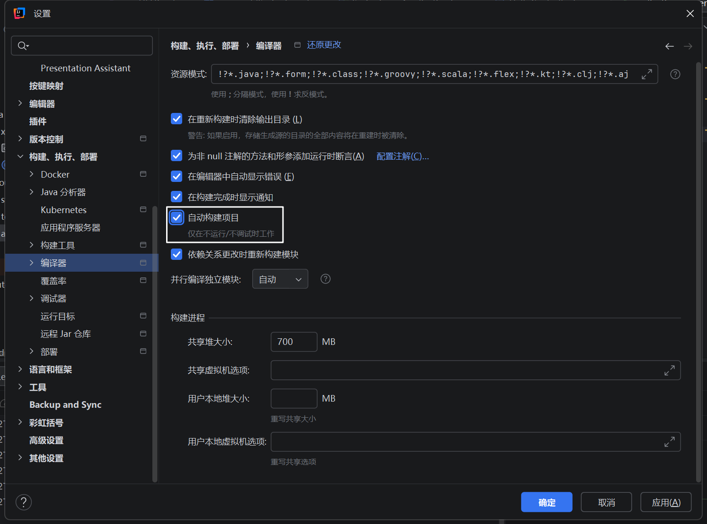
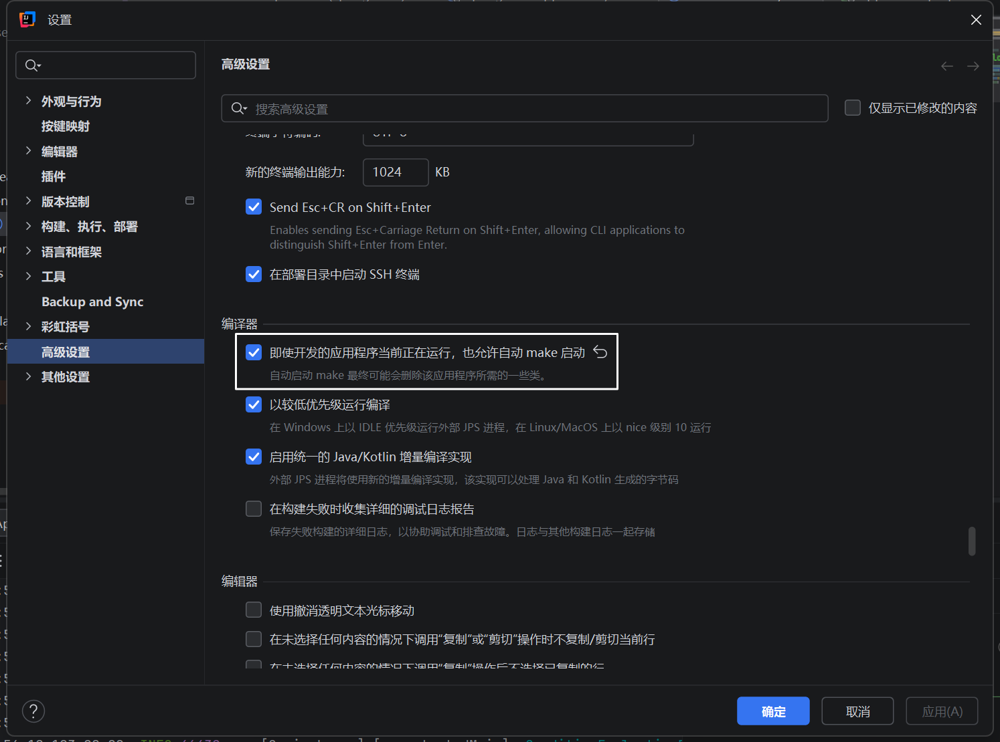

# SpringBoot Document

## SpringBoot 开发环境配置

### 开发环境热部署

SpringBoot提供了spring-boot-devtools组件，使得无需手动重启SpringBoot应用即可重新编译、启动项目。

#### 在pom.xml配置文件中添加dev-tools依赖

```xml
<dependency>
    <groupId>org.springframework.boot</groupId>
    <artifactId>spring-boot-devtools</artifactId>
    <optional>true</optional>
</dependency>
```

#### 依赖安装完后 需要在application.properties中配置devtools

```
# 热部署生效
spring.devtools.restart.enabled=true
# 设置重启目录
spring.devtools.restart.additional-paths=src/main/java
# 设置classpath目录下的WEB-INF文件夹内容修改不重启
spring.devtools.restart.exclude=static/**
```

#### 在IDEA中设置自动编译





